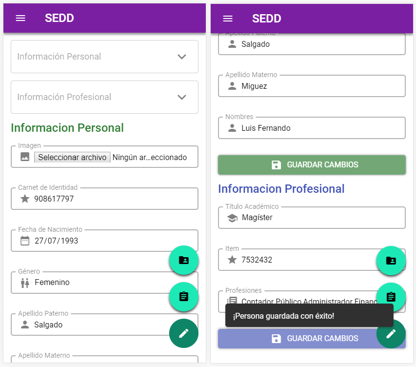

# Sistema de Evaluación de Desempeño Docente (SEDD)

Aplicación de una sola página con andamiaje (scaffolding) de [Vue CLI](https://cli.vuejs.org/), que comprende el ecosistema de vue:

- Vue Router
- Vuex

En el cual se desarrolo componentes siguiendo lineamientos de [Material Design](https://material.io/components), los cuales son:

- AppBar
- ButtonLink
- Cards
  - CardEvaluation
  - CardManagement
  - CardPerson
- FormControls
- LinkMenu
- ListInfo
- NavigationDrawer
- SnackBarComponent
- TooltipComponent
- Otros

## Depedencias

### Sistema de Rejilla de Bootstrap

|                             | < 576px | ≥ 576px | ≥ 768px | ≥ 992px | ≥ 1200px | ≥ 1600px \* |
| --------------------------- | ------- | ------- | ------- | ------- | -------- | ----------- |
| Ancho máximo del contenedor | 540px   | 720px   | 720px   | 960px   | 1140px   | 1600px      |

\*Punto de corte adicionado

### Firebase

Como servicio de backend

## Capturas

### Menu


### Gestiones


### Gestion -> Carrera


### Gestion -> Carrera -> Curso -> Paralelo


### Estudiantes


### Editar datos (Docentes y Estudiantes)




### Lista de Materias a Evaluar


### Encuesta


### Resultados


## Pendientes

- [ ] Cambiar la libreria [ Survey.js](https://surveyjs.io/) por una [propia](https://github.com/fermelli/survey).
- [ ] Refactorizar Componentes (Mixins).
- [ ] Eliminar CSS repetitivo.
- [ ] Modularizar el estado (Vuex) y el usó de MapState, MapActions, etc.
- [ ] Cambiar el Servicio de backend por una API REST en Laravel.
- [ ] Autenticación de JWT.
- [ ] More...

## Doc

[Sistema de Evaluación de Desempeño Docente](https://drive.google.com/file/d/1yN8hU9gJJqwCpqakcfwLAsGpNW84m6qB/view?usp=sharing)

## Project setup

```
npm install
```

### Compiles and hot-reloads for development

```
npm run serve
```

### Compiles and minifies for production

```
npm run build
```

### Run your tests

```
npm run test
```

### Lints and fixes files

```
npm run lint
```

### Customize configuration

See [Configuration Reference](https://cli.vuejs.org/config/).
